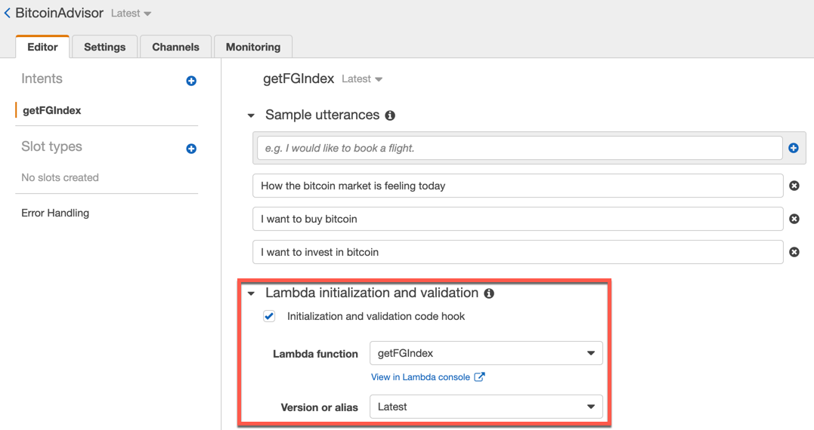

# Adding Business Logic to the Robo Advisor with AWS Lambda

In this activity, you'll add business logic to your robo advisor by connecting the Lambda function that you created before to the robo advisor.

## Instructions

1. Open the Amazon Lex console, then open BitcoinAdvisor.

2. Expand the "Lambda initialization and validation" section, select the “Initialization and validation code hook” checkbox, and then in the “Lambda function” list, select getFGIndex. In the “Version or alias” list, select Latest.

    

3. Scroll down to the "Confirmation prompt" section, expand the "Confirmation prompt" section, and then clear the “Confirmation prompt” checkbox. Expand the Fulfillment section, select the "AWS Lambda function" option, and then in the “Lambda function” list, select getFGIndex. Still in the Fulfillment section, in the “Version or alias” list, select Latest.

    

4. Click the Build button (which appears in the upper-right corner of the screen). Your robo advisor connects to Lambda to control the user's intent.

5. Test the Lambda-powered robo advisor with some sample utterances, using valid user data. The following animation shows an example of the conversation that you should have:

    

    As the preceding animation shows, the conversation is as follows:

    You: I want to buy bitcoin
    Bot: How many dollars do you want to buy?
    You: 100
    Bot: Thank you for your information; you can get 0.0021 Bitcoins for your $100 dollars. You may buy bitcoin today, the market feels 'Extreme Greed'

6. Test the Lambda-powered robo advisor with some sample utterances, using invalid user data. The following animation shows an example of the conversation that you should have:

    

    As the preceding animation shows, the conversation is as follows:

    You: I want to buy bitcoin
    Bot: How many dollars do you want to buy?
    You: 0
    Bot: The amount should be greater than zero, please provide a correct amount in dollars.
    You: 100
    Bot: Thank you for your information; you can get 0.0021 Bitcoins for your $100 dollars. You may buy bitcoin today, the market feels 'Extreme Greed'

## Optional Challenge Instructions

For this optional challenge activity, you’ll provide a recommendation about buying bitcoins according to the average value of the Bitcoin Fear & Greed Index over the last 10 days.

By checking the [alternative.me API documentation](https://alternative.me/crypto/fear-and-greed-index/#api) for this index, you can verify that the API endpoint for getting the index values for the last 10 days is the following:

`https://api.alternative.me/fng/?limit=10`

To accomplish this challenge by using the preceding endpoint, complete the following steps:

1. Modify the code of the `get_fg_index` function to get the Bitcoin Fear & Greed Index for the last 10 days by using the following endpoint

    `https://api.alternative.me/fng/?limit=10`

2. Confirm that the `get_fg_index` returns the average value of the index over the last 10 days.

3. Optionally update the text messages that the `get_recommendation` function contains to reflect the market sentiment over the last 10 days.

4. Build your Lambda function, and then retest your robo advisor.

    **Note:** Because you modified only the Lambda code, you don't need to rebuild the robo advisor.

---

© 2022 Trilogy Education Services, a 2U, Inc. brand. All Rights Reserved.